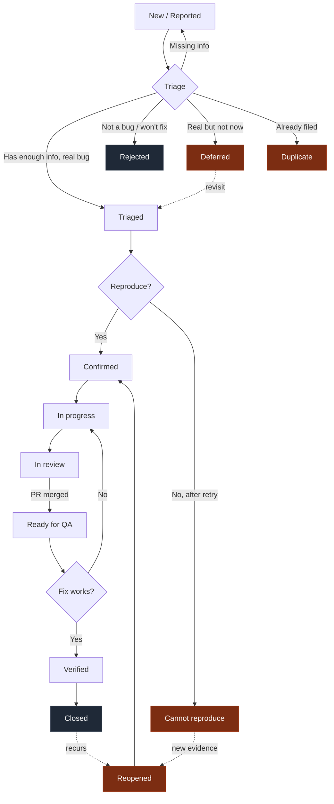

# Defect Lifecycle Workflow

How a bug moves from "someone noticed something is wrong" to "the fix is shipped and verified." This document is the connective tissue around your bug report template — without a defined lifecycle, your template just produces tickets that sit in a column forever.

## 1. Overview

A defect lifecycle is the set of states a bug passes through, plus the rules for who moves it between states. Teams that don't define this end up with a predictable set of problems: bugs disappear into "New" and never come out, the same issue gets reported three times by different people, engineers and PMs argue about whether something is "really" critical, fixes get marked done before they ship, and customers report bugs that the team thought they closed weeks ago.

The point of a lifecycle isn't bureaucracy. It's so that at any moment, anyone on the team can look at a bug and answer three questions: **What state is this in? Who owns it? What has to happen for it to move forward?** If your current process can't answer those for every open bug, you need one of these.

> The lifecycle is a tool, not a goal. If a stage isn't earning its keep — if bugs just pass through it without anything actually happening — delete the stage. Process should serve shipping, not the other way around.

---

## 2. The lifecycle stages

Each stage has entry criteria, exit criteria, an owner, and a typical duration. Durations are guidelines, not contracts — but if you blow past them consistently, that's a signal worth investigating.

### Stage 1: New / Reported

| Aspect | Detail |
|---|---|
| **Entry criteria** | A bug report has been filed in the tracker, with at minimum a title, steps to reproduce, and an environment. |
| **Exit criteria** | A triager has reviewed it and either moved it to Triaged or sent it back to the reporter for more information. |
| **Owner** | Reporter (until triage picks it up) |
| **Typical duration** | < 1 business day |

> Bugs in this stage haven't been assessed yet. They might be duplicates, they might be misunderstandings, they might be the worst bug of the quarter. Nobody knows until triage looks at them.

### Stage 2: Triaged

| Aspect | Detail |
|---|---|
| **Entry criteria** | Severity assigned, priority assigned, suggested area/component identified, no missing information from the reporter. |
| **Exit criteria** | Someone has attempted to reproduce the bug. |
| **Owner** | Triager / on-call engineer |
| **Typical duration** | < 1 business day before someone starts reproduction work |

> If your "Triaged" column has more than 20 bugs in it at any given time, you're not triaging — you're hoarding. Triage means *making a decision*, and the decision often is "we are not going to fix this." Make those decisions out loud.

### Stage 3: Confirmed

| Aspect | Detail |
|---|---|
| **Entry criteria** | Someone other than the reporter has reproduced the bug and confirmed the steps work. |
| **Exit criteria** | A developer has picked up the bug and started work. |
| **Owner** | Area owner / engineering manager |
| **Typical duration** | Depends on priority — P0 same day, P1 within sprint, P2 within 2 sprints |

> If your "Confirmed" stage takes longer than 24 hours on average for P0/P1 bugs, your triage process is broken. Fix triage before you touch anything else.

### Stage 4: In progress

| Aspect | Detail |
|---|---|
| **Entry criteria** | Developer assigned, branch created, work has actually started. |
| **Exit criteria** | A PR is open with a proposed fix. |
| **Owner** | Assigned developer |
| **Typical duration** | Hours to days, depending on complexity. Anything past 2 weeks needs to be re-evaluated. |

> A bug that's been "In progress" for more than two weeks is not in progress. It's stuck. Surface it. Either the bug is harder than triage thought (re-scope it), the developer is blocked (unblock them), or it got deprioritised silently (move it back to Confirmed). Don't let it rot in this column.

### Stage 5: In review

| Aspect | Detail |
|---|---|
| **Entry criteria** | PR is open, CI is passing, developer has self-tested the fix locally. |
| **Exit criteria** | PR is approved and merged to the target branch. |
| **Owner** | PR reviewer |
| **Typical duration** | < 1 business day for P0/P1, < 3 business days otherwise |

> The PR description should link back to the bug ticket and include either a reproduction confirmation ("repro'd, fix verified locally") or a test that fails before the fix and passes after.

### Stage 6: Ready for QA

| Aspect | Detail |
|---|---|
| **Entry criteria** | Fix is merged and deployed to a testable environment (staging, pre-production, or production behind a flag). |
| **Exit criteria** | A human other than the developer has run the original reproduction steps and confirmed the fix works. |
| **Owner** | QA / verifier (anyone-but-the-developer) |
| **Typical duration** | < 2 business days. Older than that and you have a bottleneck. |

> "Ready for QA" is the second most common bottleneck after Triage. If bugs pile up here, either nobody owns verification or the testable environment is broken. Both are solvable, but only if you notice.

### Stage 7: Verified

| Aspect | Detail |
|---|---|
| **Entry criteria** | Reproduction steps no longer trigger the bug. Verifier has also checked at least one adjacent flow for regressions. |
| **Exit criteria** | Fix has shipped to production. |
| **Owner** | Release manager / whoever owns the release train |
| **Typical duration** | Depends on release cadence — same day for continuous deploy, up to a week for scheduled releases |

### Stage 8: Closed

| Aspect | Detail |
|---|---|
| **Entry criteria** | Fix is live in production. Verifier (or release manager) has spot-checked in prod that the bug is gone. |
| **Exit criteria** | Terminal state. |
| **Owner** | — |
| **Typical duration** | Stays closed unless reopened |

> Closed means *shipped and confirmed in production*. Not merged. Not deployed to staging. Shipped, in front of real users, and verified by a human after the fact. The number of teams that conflate "merged to main" with "fixed" is depressing.

---

### Branching states

These aren't linear stages — they're outcomes that can happen at multiple points in the lifecycle.

#### Rejected / Won't fix

| Aspect | Detail |
|---|---|
| **Entry criteria** | Triage or area owner has decided not to fix. A written reason is attached. |
| **Exit criteria** | Terminal state, unless reopened by appeal. |
| **Owner** | Triager who rejected it |
| **Typical duration** | Decided within 5 business days of filing |

> Valid reasons to reject: works as intended, out of scope, deprecated feature, cost/benefit not worth it, security/architectural constraint. "We don't have time" is not a reason to reject — that's Deferred (see below).

#### Cannot reproduce

The team has tried in good faith and can't make the bug happen. Move to this state after at least two engineers have attempted reproduction, ideally on different environments.

Before moving here, the reporter must be asked once for:
- A screen recording of the bug occurring
- Exact timestamp + workspace ID so the team can search logs
- Network trace or HAR file

If 7 business days pass without the reporter providing more info, close as Cannot reproduce. If the bug recurs later, reopen with the new evidence.

#### Deferred

A known bug that the team has consciously decided not to fix right now. Distinct from Rejected — the team agrees it's a real bug worth fixing, just not in the current planning horizon. Deferred bugs should have a revisit date (e.g. "review at next quarterly planning").

> "Deferred" is the honest version of "we'll get to it." Use it. It's better than lying to yourself by leaving 200 P3 bugs in the backlog pretending you're going to fix them this year.

#### Duplicate

Process:
1. Confirm both tickets describe the same bug (same reproduction, same root cause likely).
2. Identify the **canonical ticket** — usually the older one, unless the newer one has better reproduction steps or evidence.
3. Move the better evidence/steps onto the canonical ticket.
4. Close the duplicate with a link to the canonical ticket.
5. Add the duplicate reporter as a watcher on the canonical ticket so they're notified when it closes.

#### Reopened

A bug previously in Verified or Closed has been observed again. Process:
1. Re-run the original reproduction steps to confirm it's the same bug, not a similar-but-different bug.
2. If it's the same bug: reopen the original ticket, add new evidence with a new timestamp, move to Confirmed (skip Triaged — it's already been triaged).
3. If it's a similar-but-different bug: file a new ticket and link the two.

> Never reopen a bug without re-running the original repro steps. "Looks like the same bug" is how you end up with one ticket that secretly contains four different bugs and a fix that doesn't fix anything.

---

## 3. Triage process

Triage is the most important meeting your team has that isn't called a meeting. Get it wrong and bugs pile up forever; get it right and the lifecycle takes care of itself.

**Cadence:**
- **Daily** triage for teams with > 5 bugs/day reported, or any team in a regulated/high-stakes domain. Keep it to 15 minutes.
- **Twice-weekly** triage for most SaaS startups. 30 minutes, Tuesday + Friday.
- **Weekly** triage for very small teams (under 10 people) with low bug volume. 30–45 minutes.

Whatever cadence you pick, **put it on the calendar.** Ad-hoc triage is a euphemism for no triage.

**Attendees:**
- A triager (often the on-call engineer or eng manager) — runs the meeting
- An engineer from each major product area (rotating is fine)
- A PM or product owner — provides customer-impact context
- Optional: a support representative if your support team files lots of bugs

**Triage checklist — run this for every bug in the New column:**

- [ ] Is the bug reproducible? (If unclear, assign someone to attempt reproduction before next triage.)
- [ ] Is the severity assigned correctly? (Read the severity definitions; recalibrate if needed.)
- [ ] Is the priority assigned correctly? (Severity ≠ priority. Check both.)
- [ ] Is there a clear owner — a person or team?
- [ ] Has it been linked to related tickets, PRs, or test cases?
- [ ] Has customer impact been assessed? (How many users? What plan tier? Revenue at risk?)
- [ ] Is the bug a duplicate of an existing ticket? If so, close as duplicate.
- [ ] Does it actually need to be fixed? If not, Reject or Defer with a written reason.

> Triage that consistently runs over its time slot has too many bugs entering the system, or too few decisions leaving it. Audit the cause. Don't just schedule a longer meeting.

---

## 4. Visual flow



If your tool doesn't render Mermaid, here's the ASCII version:

```
[New] -> [Triaged] -> [Confirmed] -> [In progress] -> [In review]
                                                            |
                                                            v
[Closed] <- [Verified] <- [Ready for QA] <----------- (merged)

Branches at any stage:
  -> [Rejected]          (won't fix, with reason)
  -> [Duplicate]         (close, link canonical)
  -> [Deferred]          (real bug, not now)
  -> [Cannot reproduce]  (after good-faith attempts)
  -> [Reopened]          (recurrence or new evidence) -> back to [Confirmed]
```

---

## 5. SLAs and response times

These are starting points. Adjust to your team's context — a fintech in regulated production needs tighter SLAs than a B2B SaaS in early beta. But pick numbers, write them down, and hold the line.

| Severity | First response | Resolution target |
|---|---|---|
| **Critical** | 1 hour (24/7 if you have on-call; business hours otherwise with paging escalation) | 24 hours |
| **High** | 4 hours (business hours) | 3 business days |
| **Medium** | 1 business day | 2 weeks |
| **Low** | 3 business days | Next quarter |

**First response** = the bug has been acknowledged, triaged, and either assigned or a question has been asked of the reporter. Not "we saw it." Actual movement.

**Resolution target** = bug is in Verified or Closed state. Not "the PR is merged." Not "we have a plan." Verified.

> SLAs only work if you measure them. If you set an SLA and never check whether you're hitting it, you don't have an SLA — you have a wish.

---

## 6. Roles and responsibilities

| Role | Responsibility |
|---|---|
| **Reporter** | Files the bug using the template. Provides additional info when asked. Reopens if the fix doesn't actually fix it. |
| **Triager** | Runs triage. Assigns severity, priority, owner. Bounces incomplete reports. Rejects / defers / duplicates with written reasons. |
| **Area owner** | Engineering manager or senior engineer responsible for a product area. Accepts triaged bugs into the area's queue, assigns to a developer. |
| **Developer** | Reproduces, investigates, fixes, opens PR. Writes a regression test where reasonable. Self-tests locally before requesting review. |
| **Reviewer** | Code-reviews the fix. Checks that the linked bug is actually fixed by the change. Looks for adjacent regressions. |
| **QA / Verifier** | Confirms the fix using the original reproduction steps. Checks adjacent flows for regressions. Moves to Verified or back to In progress. |
| **Release manager** | Confirms the fix has shipped to production. Moves to Closed. Coordinates rollbacks if the fix introduces new issues. |

**For teams under 10 people:** these roles will overlap. The developer who fixes a bug is often the same person who reviewed last week's fix and is on triage rotation this week. That's fine. The only role that should *never* collapse onto the same person for the same bug is **verifier** — verification has to be done by someone who didn't write the fix. See the next section.

> Roles aren't job titles. They're hats. One person can wear several hats in a week. They just can't wear two hats on the same bug at the same time.

---

## 7. Common anti-patterns

These are the specific failure modes that show up over and over in startup QA processes. If any of these sound like your team, that's where to start.

**Bugs sitting in "New" for weeks because triage isn't scheduled.** The fix is putting triage on the calendar with a recurring slot and an owner. Ad-hoc never works. If your "New" column has anything older than 3 days, triage isn't actually running.

**Developers self-verifying their own fixes.** The developer who wrote the fix is the worst possible person to verify it — they're biased toward "it works." They tested the happy path they fixed; they didn't test the case they introduced. Verification must be a separate human, every time. Even on small teams. Even when it's annoying.

**Closing bugs that haven't shipped to production yet.** Marking a ticket Done because the PR merged is how customers find bugs you thought were fixed. The bug isn't fixed until it's running in production and someone confirmed it. The gap between "merged" and "deployed" is where regressions hide.

**Conflating "merged to main" with "fixed."** Related but distinct. Merged means the code is in main. Deployed means it's running on a server. Shipped means real users can hit it. Verified-in-prod means a human has confirmed it. Only the last one is "fixed." Use separate states.

**Reopening bugs without re-running the original repro steps.** "Customer says it's back" is a starting point, not a conclusion. Re-run the original steps before reopening. Maybe it's the same bug. Maybe it's a similar-but-different bug. Maybe the customer is confused. You won't know until you reproduce.

**Severity inflation — everything is "High."** If 80% of your bugs are High or Critical, severity has lost meaning and your priority queue is just FIFO. Audit your last 50 bugs against the severity definitions. Recalibrate. Make the team push back on inflated severities in triage.

**Using "Critical" for things that are urgent-but-not-impactful.** A typo on the homepage that's embarrassing the CEO is not Critical — Critical is for data loss, security, outages. The typo might be P0 (urgent), but it's Low severity (impact). Keeping these distinct is what lets you actually prioritise during a real Critical incident.

**Triage rejecting bugs without a written reason.** "Won't fix" with no explanation creates resentment and gets the same bug refiled next month by someone else. Always write the reason — even one sentence. "Working as intended per Q1 product decision" is enough. Silence isn't.

---

## 8. Metrics worth tracking

You don't need a dashboard. You need four or five numbers reviewed in a 15-minute monthly retro. Pick from this list.

**Time in Triage (median + p90).** How long bugs sit in New before being triaged.
- Good: median < 1 business day, p90 < 3 business days.
- Bad: p90 > 1 week. Means triage isn't running often enough or is overloaded.

**Time in Ready for QA (median + p90).** How long fixes wait for verification.
- Good: median < 2 business days.
- Bad: median > 1 week. Means nobody owns verification or your testable environment is broken.

**Reopen rate.** Percentage of "Verified" or "Closed" bugs that get reopened within 30 days.
- Good: < 5%.
- Bad: > 15%. Means verification is rubber-stamping. Fixes aren't being properly tested before they're marked done.

**Escape rate.** Bugs found in production / (bugs found in production + bugs caught in QA), measured monthly.
- Good: declining over time, and < 30% for mature teams.
- Bad: > 60%, or trending up. Means QA isn't catching enough before release — either too little test coverage, too rushed, or the wrong things being tested.

**Mean time to resolution by severity.** Track Critical, High, Medium separately.
- Good: each one comfortably inside your SLA, with low variance.
- Bad: missing SLA consistently, or huge variance (some Highs fixed in a day, others taking a month). Variance means the process isn't deciding priorities consistently.

**Bugs by component/area.** Count of bugs filed per product area per month.
- Good: roughly proportional to the size and change rate of each area.
- Bad: one area producing 5× the bug volume of others. That's where technical debt lives — or where a recent refactor broke something — and it's worth a deeper look.

> Metrics are diagnostic, not punitive. Don't put them on individual engineers' performance reviews. The moment you do, people start gaming them — re-filing as new tickets, marking things closed early, refusing to file low-severity bugs. You'll measure better-looking numbers and ship worse software.

---

## Final note

This lifecycle isn't sacred. Adapt it. Rename stages to fit your tracker's columns. Collapse stages if your team is small enough that it's overkill. Add stages if your domain demands them (regulated industries often need an explicit "Compliance Review" stage before Closed).

What matters is that *every open bug has a known state, a known owner, and a known exit criterion.* If you have that, the rest is detail.
